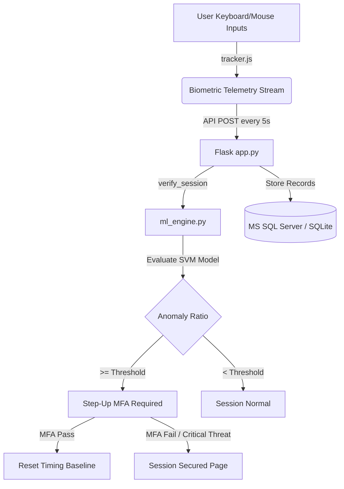

# SecureBank: Continuous Biometric Authentication System 🛡️💼

[](LICENSE)
[](https://react.dev/)
[](https://flask.palletsprojects.com/)
[](https://scikit-learn.org/)
[](https://www.microsoft.com/sql-server)

SecureBank is a state-of-the-art corporate web banking portal protected by **Continuous Biometric Authentication**. Unlike traditional banking portals that authenticate users only at login, SecureBank continuously analyzes human-computer interaction patterns (typing rhythm, keypress durations, transition flight-times, and mouse speed dynamics) in the background to ensure that the active session belongs to the authenticated user.

If the system detects anomalies in typing patterns that deviate from the user's calibrated biometric signature, it dynamically triggers a **Step-Up Multi-Factor Authentication (MFA)** challenge or instantly secures the session via a **Session Lockout**.

---

## 🌟 Premium Security Features

*   **Continuous Biometric Shield:** Real-time background timing verification running on 5-second intervals, checking keyboard typing behaviors against a customized model.
*   **One-Class SVM Classification:** Implements an RBF kernel-based `OneClassSVM` model trained specifically on each user's unique typing rhythm baseline (measuring Down-to-Down flight times, Down-to-Up hold durations, mouse tracking velocity, and click patterns).
*   **Adaptive Sensitivity Threshold:** Real-time configuration slider allowing users or system administrators to adjust the threshold at which behavioral deviation triggers step-up authentication.
*   **Step-Up MFA Safeguard:** A premium, cyber-red glassmorphic dialog that prompts the user for secondary out-of-band verification when a minor rhythm deviation is detected, preventing full lockouts for simple typing variations.
*   **Inactivity Watchdog:** A 30-second inactive auto-lock timer that clears state and secures sensitive financial information if the workstation is abandoned.
*   **Active Threat Simulators:** Includes built-in simulated threat vectors to test and demonstrate system performance against automated bot scripts, rapid screengrab attacks, or unauthorized users.

---

## 🛠️ System Architecture



---

## 📦 Project Directory Structure

```text
continuous_auth_system/
├── backend/                  # Flask REST API Server
│   ├── app.py                # Main application server routes & CORS
│   ├── ml_engine.py          # Feature extraction & One-Class SVM training/verification
│   ├── models.py             # MS SQL Server database connection & CRUD schemas
│   ├── auth_middleware.py    # JWT authorization validator
│   ├── config.py             # Server database & environment configuration
│   ├── test_db.py            # Local database driver diagnostic utility
│   ├── probe_db.py           # MS SQL server instance discovery script
│   └── requirements.txt      # Python library dependencies
│
├── frontend/                 # React SPA
│   ├── src/
│   │   ├── App.jsx           # Routing & global security watchdog
│   │   ├── main.jsx          # React app mount
│   │   ├── index.css         # Styling system (base Tailwind + cyber custom components)
│   │   ├── pages/            # Page templates (Login, Register, Train, Locked)
│   │   ├── dashboard/        # Banking Portal Pages (Home, Accounts, Transfer, SecurityHub)
│   │   └── utils/            # Helper scripts (api.js, tracker.js keystroke capture)
│   ├── package.json          # Node scripts & packages
│   ├── tailwind.config.js    # Styling configurations & modern color tokens
│   └── vite.config.js        # Vite configurations & proxy setups
│
└── .gitignore                # Root git exclusions configurations
```

---

## 🚀 Step-by-Step Installation Guide

Follow these instructions to set up the project locally on your machine.

### Prerequisites
*   **Python 3.8+**
*   **Node.js (v18+) & npm**
*   **Microsoft SQL Server** (local server instance, e.g., LocalDB or Developer Edition)
*   **ODBC Driver 17 for SQL Server** (required for `pyodbc` database connection)

---

### Step 1: Database Setup (Microsoft SQL Server)
1. Ensure your local Microsoft SQL Server instance is running. The backend default configuration is set to connect to `.\\MSSQLSERVER01` with database name `Cont_auth_db` using **Windows Authentication** (Trusted Connection).
2. If your SQL Server instance has a different name (e.g., `(localdb)\MSSQLLocalDB` or `SQLEXPRESS`), update the `MSSQL_SERVER` variable in [backend/config.py](backend/config.py) or set it via environment variables:
   ```bash
   set MSSQL_SERVER=(localdb)\MSSQLLocalDB
   ```
3. Run the database test script to verify connection drivers and instance availability:
   ```bash
   cd backend
   python test_db.py
   ```
   *If successful, it will display your SQL Server version.*

---

### Step 2: Backend Setup (Flask Server)
1. Open a terminal, navigate to the `backend` folder, and create a virtual environment:
   ```bash
   cd backend
   python -m venv venv
   ```
2. Activate the virtual environment:
   *   **Windows (PowerShell):** `.\venv\Scripts\Activate.ps1`
   *   **Windows (CMD):** `.\venv\Scripts\activate.bat`
   *   **Mac/Linux:** `source venv/bin/activate`
3. Install the required dependencies:
   ```bash
   pip install -r requirements.txt
   ```
4. Start the Flask application:
   ```bash
   python app.py
   ```
   *The server will run on `http://localhost:5000`.*

---

### Step 3: Frontend Setup (Vite / React)
1. Open a new terminal, navigate to the `frontend` folder:
   ```bash
   cd frontend
   ```
2. Install the node package dependencies:
   ```bash
   npm install
   ```
3. Build the tailwind stylesheet and start the development server:
   ```bash
   npm run dev
   ```
   *The portal will launch on `http://localhost:3000`.*

---

## 🧠 Biometric Calibration & Operation

### 1. Registration & Initial Calibration
*   Create a new account at `http://localhost:3000/register`.
*   Upon login, you will be redirected to the **Biometric Profile Calibration** page (`/train`).
*   Complete the 3-round training workflow:
    *   **Round 1:** Type the standard banking sentence naturally.
    *   **Round 2:** Enter the dynamically generated secure passcode. The virtual keyboard displays transitions live!
    *   **Round 3:** Type the list of transaction keywords in CAPITAL LETTERS.
*   Once **80+ valid keystroke timing samples** are collected, click **Activate Biometric Protection** to train your user-specific SVM model.

### 2. Monitoring & Defense Portal
*   Navigate to the **Security Dashboard** under the **Advanced Security Hub** tab.
*   Observe the **Real-Time Telemetry Stream** scroll live as you type and interact with the banking portal.
*   Adjust the **Sensitivity Threshold** slider to control how strictly behavioral deviations are locked.
*   Use the **Threat Simulators** to test:
    *   *Automated Script Simulator:* Simulates high-speed keypresses (bot-like speeds), triggering an instant **Session Secured** lockout screen.
    *   *Unusual Rhythm Simulator:* Simulates minor behavioral deviations, displaying the premium cyber-red **Step-Up Multi-Factor Authentication** modal directly on your banking dashboard.

---

## 🔒 Security & Privacy Notice
SecureBank is an educational prototype demonstrating the integration of **behavioral biometrics** and continuous machine learning authentication in corporate web applications. The model baseline parameters, keyboard features, and training intervals are optimized for demonstrations and local verification systems.

---

## 📄 License
This project is licensed under the MIT License - see the [LICENSE](LICENSE) file for details.
